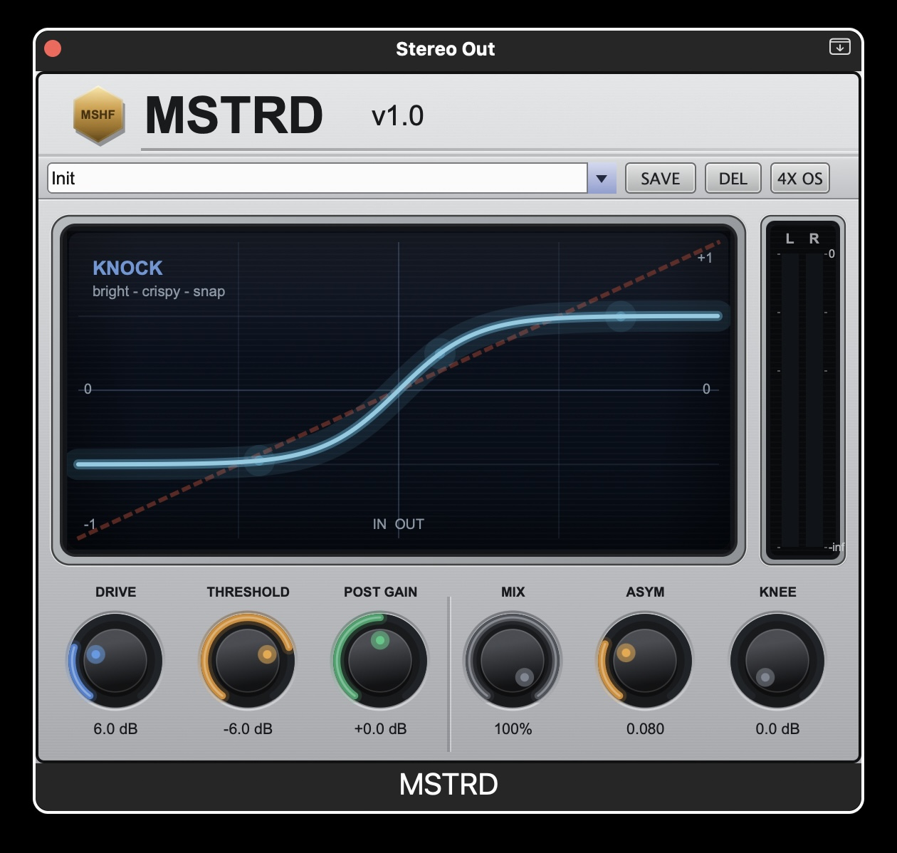

# MSTRD — Soft Clipper / Saturator



**VST3 / AU · macOS Apple Silicon · Windows x64 · Built with JUCE 8**

---

MSTRD is a soft clipper with per-mode saturation and dynamic control. Where most soft clippers give you one fixed tanh curve, MSTRD gives you four distinct DSP personalities — from transparent limiting to vintage harmonic color to VCA-driven pump — all with the same core controls. Think of it as a soft clipper you can actually shape to the material.

Built for music producers who want loudness and character without reaching for a separate saturator, compressor, and clipper on every bus.

---

## Four Modes

| Mode | Character | Good For |
|------|-----------|----------|
| **CLEAN** | Transparent, near-linear ceiling | Master bus, stems, anything where loudness > color |
| **KNOCK** | Snappy, transient-forward | Drums, 808s, percussion buses |
| **VD** | Warm, 2nd-harmonic body | Sample chops, pads, analog-flavored mixdowns |
| **GRIT** | Pumping VCA crunch | Full mix energy, trap/drill character, glue |

### CLEAN
Symmetric tanh waveshaping with low coloration. Acts like a transparent brick-wall without the harshness of a hard clipper. Use it on the master bus when you want loudness without changing the tone.

### KNOCK
A dual envelope-follower (1 ms fast / 10 ms slow) detects transient edges and boosts them before the tanh stage. Hi-hats cut harder, snares snap, 808 attacks pop through the mix. Sounds like it's been referenced against Pi'erre Bourne, OG Parker, Maaly Raw.

### VD (Vintage Drive)
Asymmetric tanh waveshaping adds even-order harmonic content — the kind you get from tape or a driven tube preamp. A Julius O. Smith DC blocker keeps the signal centered. Adds body and warmth without obvious distortion. Reference point: J Dilla, Pete Rock, classic MPC-era boom bap.

### GRIT
A stereo-linked VCA compressor (8:1 ratio, 1 ms attack, 150 ms program-dependent release) hits the signal before a tanh ceiling. The release extends up to 4× when deep in gain reduction, giving you natural pump and breathe. DC blocked on output. Not subtle — designed for full-mix energy and movement.

---

## Controls

| Parameter | Range | Default | Notes |
|-----------|-------|---------|-------|
| Drive | 0 – 24 dB | 6 dB | Input gain into the clipping stage |
| Threshold | −24 – 0 dB | −6 dB | Clip ceiling |
| Post Gain | −12 – +12 dB | 0 dB | Output trim after clipping |
| Mix | 0 – 100% | 100% | Dry/wet parallel blend |
| Asymmetry | 0 – 0.3 | 0.08 | 2nd-harmonic bias — VD mode mainly |
| Knee Width | 0 – 20 dB | 0 dB | Soft knee amount around the threshold |

All parameters are fully automatable and saved per DAW session.

---

## Oversampling

Runs at **4× IIR polyphase oversampling** by default to suppress aliasing at high drive. Click the **OS** button to toggle to **2× OS** if you need to reduce CPU on older machines. The switch happens at the next audio block — use it during setup, not as automation.

---

## Presets

**5 factory presets** (read-only):

| Preset | Mode | Character |
|--------|------|-----------|
| Init | KNOCK | Default starting point |
| Clean Open | CLEAN | Transparent loudness ceiling |
| Knock Snap | KNOCK | Aggressive transient crunch |
| VD Warmth | VD | Vintage body blend at 50% mix |
| Grit Crush | GRIT | Heavy VCA pump, full drive |

**User presets** are saved as XML:

```
macOS   ~/Library/Application Support/Soft Clipper/Presets/
Windows %APPDATA%\Soft Clipper\Presets\
```

Hit **SAVE** to name and write a user preset. **DEL** removes the currently selected user preset.

---

## Installation (Build from Source)

> There are no pre-built binaries — you build from source. This takes about 5 minutes on a modern machine.

### macOS (Apple Silicon — M1 through M5)

**Prerequisites:**

| Tool | How to get it |
|------|--------------|
| Xcode | App Store → then run `xcode-select --install` |
| CMake ≥ 3.22 | `brew install cmake` or [cmake.org](https://cmake.org/download/) |

**Build:**

```bash
git clone https://github.com/vedanthgumaj-afk/MSTRD-Plugin.git
cd MSTRD-Plugin

cmake -B build -DCMAKE_BUILD_TYPE=Release -DCMAKE_OSX_ARCHITECTURES=arm64
cmake --build build --config Release --parallel
```

JUCE 8 downloads automatically via CMake FetchContent on first run (~200 MB). After the build, plugins are installed automatically:

| Format | Location |
|--------|----------|
| AU | `~/Library/Audio/Plug-Ins/Components/Soft Clipper.component` |
| VST3 | `~/Library/Audio/Plug-Ins/VST3/Soft Clipper.vst3` |

---

### Windows (x64 — VST3 only)

**Prerequisites:**

| Tool | How to get it |
|------|--------------|
| Visual Studio 2022 | Install with **Desktop development with C++** workload |
| CMake ≥ 3.22 | [cmake.org](https://cmake.org/download/) — tick **Add to PATH** during install |

**Build (PowerShell as Administrator):**

```powershell
git clone https://github.com/vedanthgumaj-afk/MSTRD-Plugin.git
cd MSTRD-Plugin

cmake -B build -G "Visual Studio 17 2022" -A x64
cmake --build build --config Release --parallel
```

Installs to `C:\Program Files\Common Files\VST3\Soft Clipper.vst3`.
Run PowerShell as Administrator if you get an access denied error.

---

### Rescan in your DAW after building

| DAW | Where to rescan |
|-----|----------------|
| Logic Pro | Settings → Plug-in Manager → Reset & Rescan All |
| Ableton Live | Options → Manage Plug-ins → Rescan |
| FL Studio | Options → Manage Plugins → Start Scan |
| Reaper | Options → Preferences → Plug-ins → VST → Re-scan |

---

## Tested

| DAW | Format | Platform |
|-----|--------|----------|
| Logic Pro 10.8 | AU | macOS arm64 |
| Ableton Live 12 | VST3 | macOS arm64 |
| Reaper 7 | VST3 + AU | macOS arm64 |
| Ableton Live 12 | VST3 | Windows x64 |
| FL Studio 21 | VST3 | Windows x64 |

> **Pro Tools (AAX)** requires a paid Avid developer certificate — not included.

---

## Project Structure

```
MSTRD-Plugin/
├── CMakeLists.txt
├── README.md
├── assets/
│   └── plugin_ui.jpg
└── Source/
    ├── PluginProcessor.h/.cpp   — DSP engine (4 modes, oversampling, VCA, meters)
    ├── PluginEditor.h/.cpp      — UI (knobs, mode selector, meters, transfer curve)
    └── PresetManager.h/.cpp     — Factory + user preset system
```

---

## Troubleshooting

**"Cannot be opened because the developer cannot be verified" (macOS Gatekeeper)**
```bash
sudo xattr -rd com.apple.quarantine ~/Library/Audio/Plug-Ins/VST3/"Soft Clipper.vst3"
sudo xattr -rd com.apple.quarantine ~/Library/Audio/Plug-Ins/Components/"Soft Clipper.component"
```

**AU not showing in Logic Pro**
```bash
auval -v aufx Sclp Ynme
```
If validation fails, check that `BUNDLE_ID`, `PLUGIN_MANUFACTURER_CODE`, and `PLUGIN_CODE` in `CMakeLists.txt` are set correctly and don't conflict with another installed plugin.

**FetchContent slow or timing out**

Clone JUCE manually and point CMake at it:
```bash
git clone --depth 1 --branch 8.0.4 https://github.com/juce-framework/JUCE.git
```
Then in `CMakeLists.txt`, replace the `FetchContent_Declare(JUCE ...)` block with:
```cmake
add_subdirectory(/path/to/JUCE)
```

---

## License

Source code in this repository is available for personal and educational use.
Commercial distribution of compiled binaries requires explicit permission.

---

*Built by [@vedanthgumaj-afk](https://github.com/vedanthgumaj-afk)*
